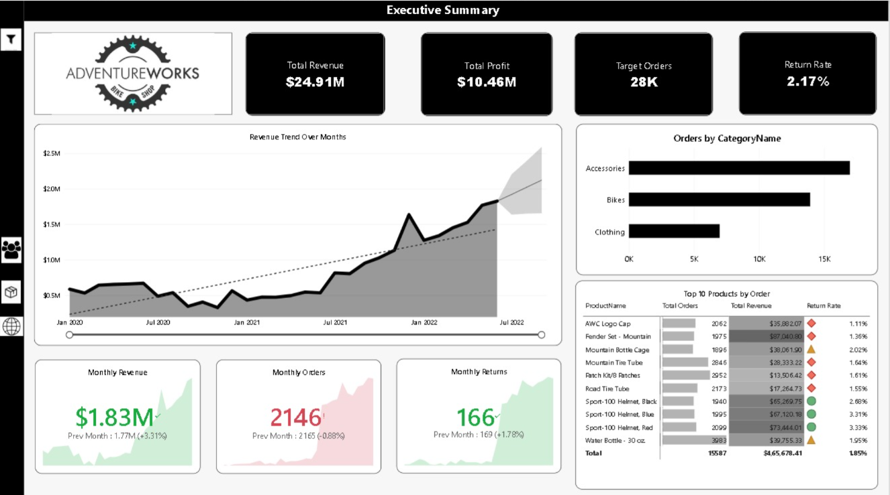
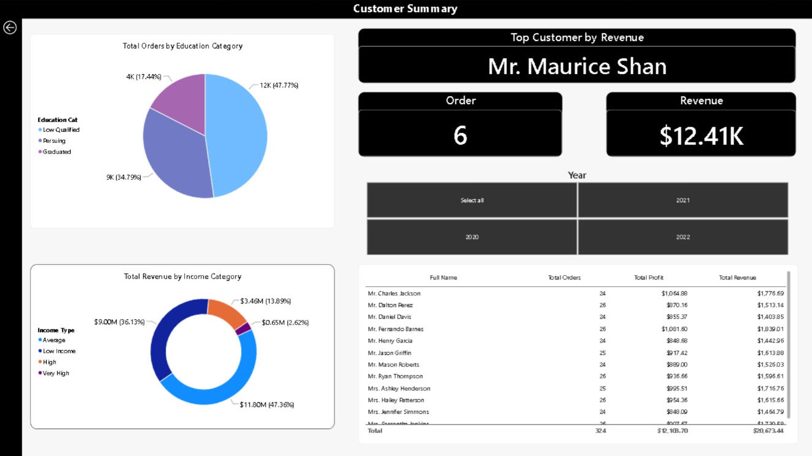
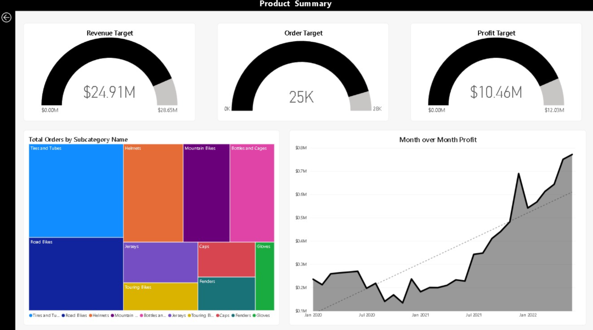
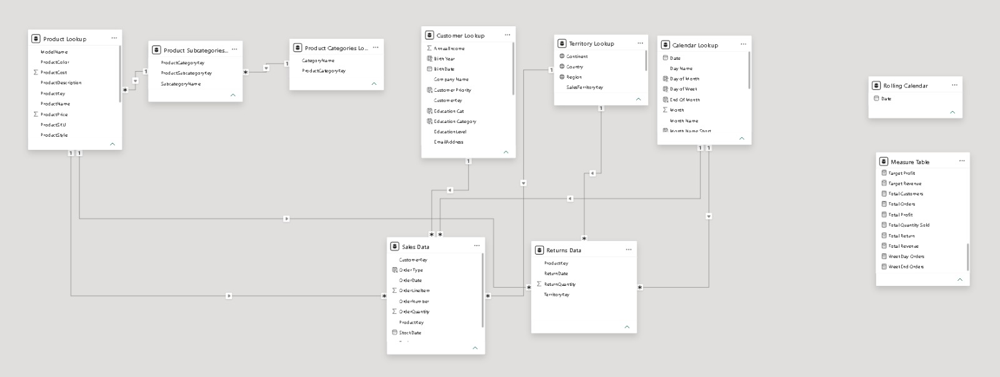

# 🚲 AdventureWorks Global Sales & Performance Analytics


An executive-level, interactive Business Intelligence solution built in **Microsoft Power BI** to analyze sales trajectory, profitability, customer acquisition, and return rates for **AdventureWorks**, a global manufacturer of cycling equipment and accessories.

---

## 📌 Problem Statement

AdventureWorks lacked a centralized, real-time reporting system to monitor regional sales trends, evaluate product-level profitability, and track customer acquisition patterns. This created blind spots in identifying high-return product lines and measuring daily performance against the company's 15% revenue growth targets. To resolve this, a multi-page Power BI dashboard was built to transform fragmented operational data into actionable, executive-level insights.

---

## 🎯 Business Objectives

* Design and implement a robust **Star Schema semantic model** integrating multi-source transactional, customer, product, and territory data.
* Engineer optimized **DAX measures** for dynamic period-over-period comparisons, rolling windows, and profitability variance[cite: 6, 7, 8].
* Deliver an intuitive **4-page interactive dashboard** with custom bookmark-driven navigation, slicer drawer panels, and drill-through capabilities.

---

## 🧭 Dashboard Architecture & Report Pages

The dashboard is structured into 4 interactive reporting pages:

### Page 1: Executive Overview
High-level strategic snapshot monitoring macroeconomic indicators, executive KPI cards (Total Revenue, Total Profit, Total Orders), regional breakdowns, and monthly trajectory against target benchmarks[cite: 6, 8].



---

### Page 2: Customer Demographics & Segmentation
Detailed analysis of demographic drivers (income tier, occupation, education level, homeowner status), customer acquisition rates, and revenue distribution per customer[cite: 6].



---

### Page 3: Product Performance & Category Drill-Down
Evaluation of product line profitability, unit volume distributions, order patterns across subcategories (Bikes, Components, Apparel, Accessories), and return rate monitoring[cite: 8].



---

### Page 4: Operational Deep-Dive & Transaction Explorer
Granular tabular view featuring row-level transaction tracking, dynamic multi-field slicers, conditional formatting flags for low-margin lines, and return volume indicators[cite: 8].


---

## 🏗️ Data Architecture & Star Schema Model

The data model follows an optimized **Star Schema** to ensure query performance and clean filter propagation:



### Model Entities
* **Fact Tables:**
  * `Sales Data` — Transaction-level sales records (Order Number, Order Date, Product Key, Customer Key, Order Quantity, Territory Key)[cite: 6].
  * `Returns Data` — Product return logs (Return Date, Territory Key, Product Key, Return Quantity)[cite: 8].
* **Dimension (Lookup) Tables:**
  * `Calendar Lookup` — Contiguous date table supporting time intelligence[cite: 7].
  * `Customer Lookup` — Customer demographics and profile attributes[cite: 6].
  * `Product Lookup`, `Product Subcategories Lookup`, `Product Categories Lookup` — Item master data, cost, price, and category hierarchy[cite: 6].
  * `Territory Lookup` — Geographic regions, countries, and groups.

---

## 💡 Key DAX Measures

Measures are modularized into dedicated files inside the `/dax` directory:

### 1. Core Financials & Aggregations (`dax/01_kpis_and_aggregations.dax`)[cite: 6]
```dax
// Total Revenue calculated at row granularity using iterator SUMX
Total Revenue = 
SUMX(
    'Sales Data',
    'Sales Data'[OrderQuantity] * RELATED('Product Lookup'[ProductPrice])
)

// Total Profit after deducting cost
Total Profit = 
[Total Revenue] - [Cost Price]

// Average Revenue per Unique Customer
Average Revenue per Customer = 
DIVIDE(
    [Total Revenue],
    [Total  Customers]
)

// Overall Average Benchmark Price (ignoring visual filter context)
Overall average price = 
CALCULATE(
    AVERAGE('Product Lookup'[ProductPrice]),
    ALL('Product Lookup')
)
```

2. Time-Intelligence Calculations (dax/02_time_intelligence.dax)
```dax
// 90-Day Moving Horizon Revenue
90 day Rolling Revenue = 
CALCULATE(
    [Total Revenue],
    DATESINPERIOD(
        'Calendar Lookup'[Date],
        MAX('Calendar Lookup'[Date]),
        -90,
        DAY
    )
)

// Month-to-Date (MTD) Revenue
MTD Revenue = 
CALCULATE(
    [Total Revenue],
    DATESMTD('Calendar Lookup'[Date])
)

// Previous Month Orders for Month-over-Month Comparison
Prev Month Orders = 
CALCULATE(
    [Total Orders],
    DATEADD('Calendar Lookup'[Date], -1, MONTH)
)
```
3. Targets & Operational Variance (dax/03_targets_and_variance.dax)
```dax
// Product Return Rate with safe error handling
Return Rate = 
DIVIDE(
    [Quantity Returned],
    [Total Quantity Sold],
    "Not applicable"
)

// Strategic Target Revenue (15% Growth Target)
Target Revenue = 
[Total Revenue] * 1.15
```

📂 Repository Structure : 

AdventureWorks_Sales_Analysis/
│
├── screenshots/                     # Visual proofs and dashboard captures
│   ├── overview.png
│   ├── customer_analysis.png
│   ├── product_analysis.png
│   ├── details.png
│   └── data_model.png
│
├── data/                            # Sample raw source CSV datasets
│   ├── AdventureWorks Sales Data 2020.csv
│   ├── AdventureWorks Returns Data.csv
│   ├── AdventureWorks Customer Lookup.csv
│   ├── AdventureWorks Product Lookup.csv
│   └── AdventureWorks Calendar Lookup.csv
│
├── dax/                             # Plaintext DAX formulas for code inspection
│   ├── 01_kpis_and_aggregations.dax
│   ├── 02_time_intelligence.dax
│   └── 03_targets_and_variance.dax
│
├── src/                             # Power BI project files (PBIP format)
│   ├── Sales_Data_Analysis.pbip
│   ├── Sales_Data_Analysis.Report/
│   └── Sales_Data_Analysis.SemanticModel/
│
├── .gitignore                       # Standard Power BI temporary/cache ignores
└── README.md                        # Portfolio documentation page


🚀 How to Run Locally: 
     Prerequisites
            • Microsoft Power BI Desktop (Latest Version recommended)
            • Git installed on your machine

Steps: 
1. Clone this repository:
```
git clone [https://github.com/](https://github.com/)<your-username>/<your-repo-name>.git
```
2. Navigate to the project root directory:
```
cd <your-repo-name>
```

3. Open src/Sales_Data_Analysis.pbip in Power BI Desktop.

If prompted to refresh credentials or paths, redirect source connections to the files provided in the /data folder.

👤 Author

Portfolio / GitHub: @Prathamesh Kasande

LinkedIn: linkedin.com/in/prathamesh-kasande-79b76525b/
